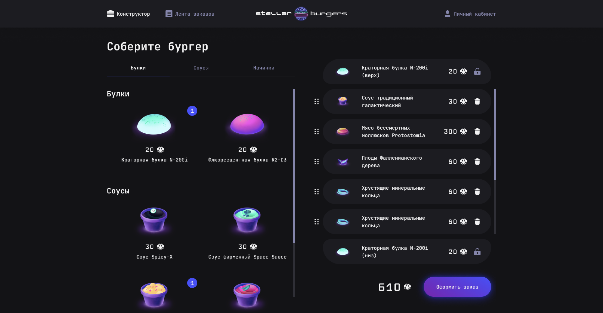

# Каноническая работа проекта Stellar Burger 
# Этап "Промежуточный проект. CRA-заготовка и структура папок под компоненты"

---

## 🌐 Сссылки на проект
1. [Figma](https://www.figma.com/file/ocw9a6hNGeAejl4F3G9fp8/React-_-%D0%9F%D1%80%D0%BE%D0%B5%D0%BA%D1%82%D0%BD%D1%8B%D0%B5-%D0%B7%D0%B0%D0%B4%D0%B0%D1%87%D0%B8-(3-%D0%BC%D0%B5%D1%81%D1%8F%D1%86%D0%B0)_external_link?node-id=0%3A1&mode=dev) - макет проекта 

---

## 📗 О проекте Stellar Burger

Stellar Burger - это интернет страница космичесской бургерной.

Тут вы можете заказать всё что вашей душе захочется и вкусить за символическую цену.

_Главная страница_

---

## 🥣 О реализации
* Реализована вёрстка главной страницы с использованием технологии CRA на React.js.
* Файловая структура основана на компонентной составляющей по системе БЭМ.
* Реализовано:
  1. Добавление ингредиентов в конструктор бургера
  2. Отображения модального окна при выборе ингредиента по клику
  3. Подсчёт колличества ингредиентов при клике на ингредиент
  4. Отображение модального окна общего заказа при нажатии на кнопку _Оформить заказ_
  5. Бесконечная анимация пятиугольников в общем заказе

---

## 📈 Планы по развитию
* Реализовать перетаскивание Drag'nDrop для ингредиентов бургера
* Настроить работу перемещения по ссылкам на странице
* Настроить добавление заказа в Back-end часть.
* Создать систему авторизации пользователя и её настройка
* Произвести адаптивную верстку на мобильные и планшетные версии.

---

## ⚙️ Стек технологий
HTML5, CSS3, JavaScript, React, GitHub, WebPack, TypeScript

           

---

## Команда разработчиков

[Ярослав Шадрин](https://github.com/DislJack) 🤟\

## 📜 Инструкция по запуску на локальной машине
- Установить [Node.js](https://nodejs.org/ru/)
- Клонировать репозиторий ` git clone git@github.com:DislJack/react-stellar-burger.git`
- Установить зависимости `npm install`
- Запустить приложение `npm run start`